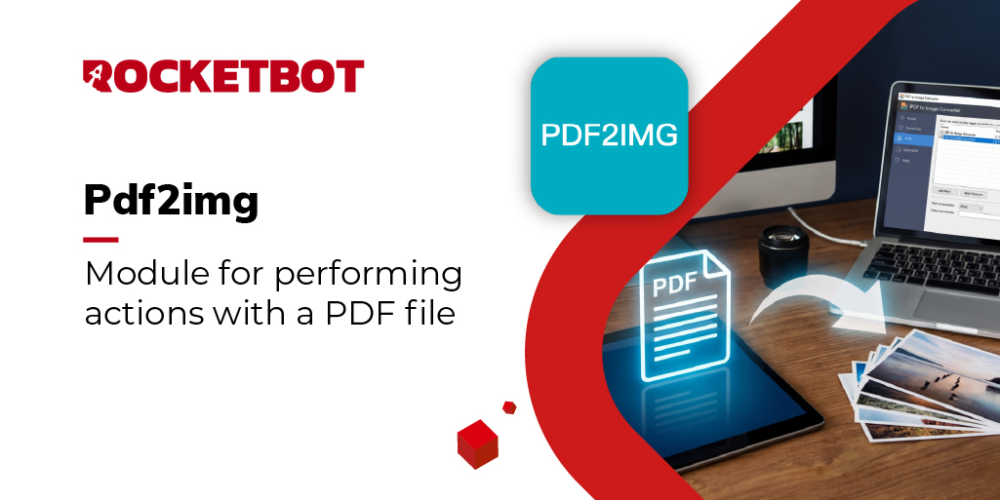

# Pdf2Img
  
Módulo para realizar acciones con un archivo pdf  

*Read this in other languages: [English](Manual_Pdf2Img.md), [Português](Manual_Pdf2Img.pr.md), [Español](Manual_Pdf2Img.es.md)*
  

## Como instalar este módulo
  
Para instalar el módulo en Rocketbot Studio, se puede hacer de dos formas:
1. Manual: __Descargar__ el archivo .zip y descomprimirlo en la carpeta modules. El nombre de la carpeta debe ser el mismo al del módulo y dentro debe tener los siguientes archivos y carpetas: \__init__.py, package.json, docs, example y libs. Si tiene abierta la aplicación, refresca el navegador para poder utilizar el nuevo modulo.
2. Automática: Al ingresar a Rocketbot Studio sobre el margen derecho encontrara la sección de **Addons**, seleccionar **Install Mods**, buscar el modulo deseado y presionar install.  

## Descripción de los comandos

### Convertir a JPG
  
Convierte cada hoja de un archivo pdf a formato jpg
|Parámetros|Descripción|ejemplo|
| --- | --- | --- |
|PDF de entrada|Ubicación de la carpeta donde se encuentra el PDF a convertir a JPG|archivo.pdf|
|Ruta y nombre del archivo jpg a guardar|Ubicación y nombre del archivo jpg que se guardará. Si el pdf contiene más de una hoja, se añadirá el numero de hoja a los archivos|C:/Users/User/Desktop/imagen.jpg|
|Ancho de imagen|Valor numérico que representará el ancho de la imagen en píxeles.|1500|
|DPI|DPI o Puntos por pulgada que tendrá la imagen. Por defecto son 150 DPI|150|
|Resultado|Variable donde será almacenado True o False dependiendo si el módulo pudo ejecutar la acción|variable|

### Agregar imagen a PDF
  
Agrega una imagen a un PDF en la página y coordenadas ingresadas.
|Parámetros|Descripción|ejemplo|
| --- | --- | --- |
|PDF de entrada|Archivo pdf al que se le añadirá la imagen|archivo.pdf|
|archivo JPG|Archivo jpg que será agregado al pdf|path/imagen.jpg|
|Página|Número de página del pdf donde será agregada la imagen|3|
|Coordenadas|Coordenadas de la página del pdf donde se colocará la imagen. Si se colocan coordenadas más altas que el tamaño de la página, la imagen no se podrá visualizar.|150,340|
|PDF de salida|Ubicación del archivo pdf generado con la nueva imagen|path/nuevo_archivo.pdf|
|Resultado|Variable donde será almacenado True o False dependiendo si el módulo pudo ejecutar la acción|variable|

### Recortar imagen desde PDF
  
Crea una imagen desde las coordenadas asignadas.
|Parámetros|Descripción|ejemplo|
| --- | --- | --- |
|PDF de entrada|Archivo pdf que será utilizado en el módulo|archivo.pdf|
|Imagen jpg|Ruta y nombre que tendrá la imagen jpg extraída del pdf|path/imagen.jpg|
|Página|Número de página del pdf desde donde será obtenida la imagen|3|
|Coordenadas de Inicio|Coordenadas desde donde se obtendrá la imagen|0,0|
|Coordenadas de Fin|Coordenadas hasta donde se obtendrá la imagen|1000,1000|
|DPI|DPI o Puntos por pulgada que tendrá la imagen. Por defecto son 150 DPI|150|
